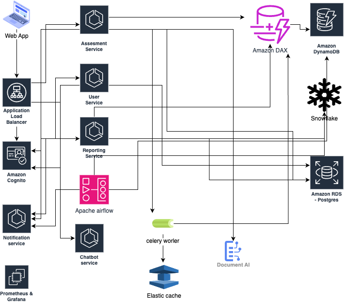

## Web APP : (Next JS)
There will be two web apps
- Catlayst app (Catalyst team can create the assesments)
- Assesment app (customer will fill the assesment)

All the payload which sends to the server will encrypted using the RSA public key over TLS to make the encryption at transist.
API request will be mostly of graphql

## Amazon cognito :
Amazon conginito will be used as authetication and authorization service basically oauth provider with multi tenancy. Seperate user pool for every tenant will be used. 

## AWS Load balancer :
AWS apllication load balance will be used to distrubute the API loads and AWS WAF will be added in top of load balancer for further security practices.
All request will be logged in cloudwatch for further latency analysis.

## Assesment Service :
This will be core service which will be written in Fast API. It will expose for both graphql APIs. Auto save mechanism will use the graphql subcription with the sticky session in AWS loadbalancer. This will be used to both create the assement as well submit the assesment. So all API related to creation and submission wilt be present in this service.